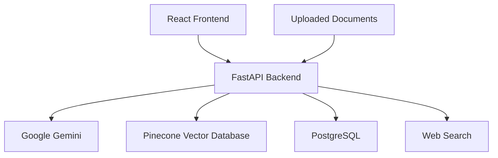

# 🤖 Personal AI Assistant Platform

A production-ready AI-powered Personal Assistant built using **FastAPI**, **Google Gemini**, **Pinecone**, **PostgreSQL**, **Docker**, and **React**.

The application enables users to chat with an AI assistant, upload documents for Retrieval-Augmented Generation (RAG), perform intelligent web searches when required, maintain conversation history, and interact through a modern web interface.

---

## 🚀 Features

- 🔐 User Authentication (Signup & Login)
- 💬 Persistent Chat Sessions
- 🧠 Conversation Memory
- 📄 Upload PDF, DOCX and TXT documents
- ✂️ Automatic Document Chunking
- 🔍 Semantic Search using Pinecone
- 🤖 Google Gemini Powered Responses
- 🌐 Intelligent Web Search Routing
- 🔄 Search Query Rewriting
- 📚 Retrieval-Augmented Generation (RAG)
- 🎤 Voice Input Support
- 💾 PostgreSQL Database
- 🐳 Fully Dockerized Application
- ⚡ Modern React + TypeScript Frontend

---

# 🏗️ System Architecture



---

# ⚙️ Tech Stack

| Layer | Technology |
|--------|------------|
| Backend | FastAPI |
| Frontend | React + Vite + TypeScript |
| Database | PostgreSQL |
| Vector Database | Pinecone |
| LLM | Google Gemini |
| Embeddings | Gemini Embedding API |
| Document Processing | PyMuPDF, python-docx |
| Web Search | DuckDuckGo + BeautifulSoup |
| Authentication | bcrypt |
| API Communication | Axios |
| Containerization | Docker + Docker Compose |

---

# 📁 Project Structure

```text
Personal_AI_Assistant_Platform
│
├── backend
│   ├── index.py
│   ├── database.py
│   ├── requirements.txt
│   ├── Dockerfile
│   ├── .dockerignore
│   ├── .env.example
│   └── ...
│
├── frontend
│   ├── src
│   ├── Dockerfile
│   ├── .dockerignore
│   ├── package.json
│   ├── .env.example
│   └── ...
│
├── docker-compose.yml
├── .env.example
├── README.md
└── .gitignore
```

---

# 🧠 How It Works

```text
User Query
      │
      ▼
Retrieve Chat History
      │
      ▼
Retrieve Relevant Document Chunks
      │
      ▼
Determine Whether Web Search Is Required
      │
      ├───────────────► No
      │                    │
      ▼                    │
Rewrite Search Query        │
      │                    │
      ▼                    │
Web Search                  │
      │                    │
      └──────────────┐      │
                     ▼      ▼
          Response Generation
                     │
                     ▼
         Store Chat History
                     │
                     ▼
             Return Response
```

---

# 📚 API Endpoints

## Authentication

| Method | Endpoint | Description |
|--------|----------|-------------|
| POST | `/signup` | Register a new user |
| POST | `/login` | Login |

---

## Chat

| Method | Endpoint | Description |
|--------|----------|-------------|
| POST | `/sessions` | Create a chat session |
| GET | `/chat/sessions/{userId}` | Get all sessions |
| GET | `/chat/history/{sessionId}` | Get chat history |
| DELETE | `/sessions/{sessionId}` | Delete session |
| POST | `/generate` | Generate AI response |

---

## Documents

| Method | Endpoint | Description |
|--------|----------|-------------|
| POST | `/upload-document` | Upload PDF, DOCX or TXT |

---

# 🧠 AI Workflow

The backend follows a Retrieval-Augmented Generation (RAG) pipeline.

### Step 1

Receive the user's query.

### Step 2

Generate embeddings using Gemini Embedding API.

### Step 3

Retrieve relevant document chunks from Pinecone.

### Step 4

Retrieve recent conversation history.

### Step 5

Determine whether external web search is required.

### Step 6

If required:

- Rewrite the search query
- Search the web
- Scrape relevant pages
- Summarize retrieved content

### Step 7

Generate the final response using:

- Conversation history
- Retrieved document chunks
- Web search results (if available)

### Step 8

Store both user and assistant messages in PostgreSQL.

---

# 🐳 Running with Docker

## Clone Repository

```bash
git clone https://github.com/<your-username>/Personal_AI_Assistant_Platform.git

cd Personal_AI_Assistant_Platform
```

---

## Configure Environment Variables

Create the following files from the provided examples.

```
.env
backend/.env
frontend/.env
```

---

## Build Containers

```bash
docker compose up --build
```

---

## Application URLs

Frontend

```
http://localhost:5173
```

Backend

```
http://localhost:8000
```

---

# 🔑 Environment Variables

## Root

```env
DB_NAME=
DB_USER=
DB_PASSWORD=
```

---

## Backend

```env
GEMINI_API_KEY=

PINECONE_API_KEY=
PINECONE_INDEX=
PINECONE_HOST=

DB_NAME=
DB_USER=
DB_PASSWORD=
DB_HOST=
DB_PORT=
```

---

## Frontend

```env
VITE_API_URL=http://localhost:8000
```

---

# 📦 Docker Services

The project consists of three containers.

| Container | Description |
|------------|-------------|
| PostgreSQL | Stores users, chat sessions and conversation history |
| FastAPI | Backend API, AI orchestration and RAG |
| React + Nginx | User Interface |

All services are managed using Docker Compose.

---

# 📈 Future Improvements

- JWT Authentication
- Streaming AI Responses
- Redis Caching
- Hybrid Search
- Multi-document RAG
- Google GenAI SDK Migration
- CI/CD with GitHub Actions
- Kubernetes Deployment
- Cloud Deployment (AWS/GCP/Azure)

---

# 📸 Screenshots

Add screenshots here.

```
screenshots/
    login.png
    signup.png
    chat.png
    upload.png
    docker.png
```

Example:

```markdown

```

---

# 👨‍💻 Author

**Chinmay Pathak**

Backend Developer | AI Enthusiast

GitHub:
https://github.com/ChinuPathak

---

# ⭐ If you found this project useful, please consider giving it a star.
