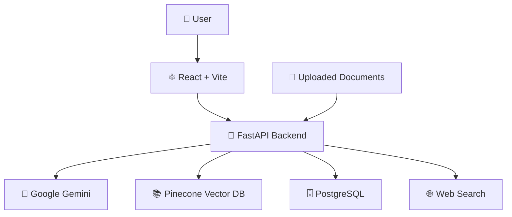
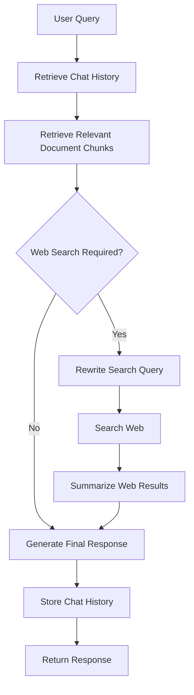

# 🤖 Personal AI Assistant Platform

A production-ready AI-powered Personal Assistant built using
**FastAPI**, **Google Gemini**, **Pinecone**, **PostgreSQL**,
**Docker**, and **React**.

The platform supports Retrieval-Augmented Generation (RAG), intelligent
web search routing, semantic search, document understanding, persistent
chat sessions, and voice input.

------------------------------------------------------------------------

# ✨ Features

-   🔐 User Authentication (Signup & Login)
-   💬 Persistent Chat Sessions
-   🧠 Conversation Memory
-   📄 Upload PDF, DOCX and TXT Documents
-   ✂️ Automatic Document Chunking
-   🔍 Semantic Search using Pinecone
-   🤖 Google Gemini Powered Responses
-   🌐 Intelligent Web Search Routing
-   🔄 Search Query Rewriting
-   📚 Retrieval-Augmented Generation (RAG)
-   🎤 Voice Input Support
-   💾 PostgreSQL Database
-   🐳 Fully Dockerized (Frontend + Backend + PostgreSQL)
-   ⚡ React + Vite Frontend

------------------------------------------------------------------------

# 🏗️ System Architecture



------------------------------------------------------------------------

# 🧠 AI Response Workflow



------------------------------------------------------------------------

# ⚙️ Tech Stack

  Layer                 Technology
  --------------------- ----------------------------
  Backend               FastAPI
  Frontend              React + Vite + TypeScript
  Database              PostgreSQL
  Vector Database       Pinecone
  LLM                   Google Gemini
  Embeddings            Gemini Embedding API
  Document Processing   PyMuPDF, python-docx
  Web Search            DuckDuckGo + BeautifulSoup
  Authentication        bcrypt
  Containerization      Docker & Docker Compose

------------------------------------------------------------------------

# 📁 Backend Structure

``` text
backend/
│
├── index.py
├── database.py
├── requirements.txt
├── Dockerfile
├── .dockerignore
├── .env.example
├── prompts/
├── utils/
└── ...
```

------------------------------------------------------------------------

# 🚀 Application Flow

1.  User submits a query.
2.  Backend retrieves the last conversation history.
3.  Relevant document chunks are retrieved from Pinecone.
4.  AI decides whether a web search is required.
5.  If needed, the search query is rewritten.
6.  Relevant web pages are scraped and summarized.
7.  Gemini generates the final response using:
    -   Conversation history
    -   Retrieved document chunks
    -   Web search results (if any)
8.  User and assistant messages are stored in PostgreSQL.

------------------------------------------------------------------------

# 📚 API Endpoints

  Method   Endpoint                      Description
  -------- ----------------------------- ----------------------
  POST     `/signup`                     Register User
  POST     `/login`                      Login
  POST     `/sessions`                   Create Chat Session
  GET      `/chat/sessions/{userId}`     Get User Sessions
  GET      `/chat/history/{sessionId}`   Get Chat History
  POST     `/generate`                   Generate AI Response
  POST     `/upload-document`            Upload Document
  DELETE   `/sessions/{sessionId}`       Delete Session

------------------------------------------------------------------------

# 📸 Screenshots

Place your screenshots inside:

``` text
screenshots/
├── login.png
├── signup.png
├── chat.png
├── document-upload.png
└── docker-compose.png
```

Example:

``` md

```

------------------------------------------------------------------------

# 🐳 Running with Docker

``` bash
git clone https://github.com/your-username/Personal_AI_Assistant_Platform.git
cd Personal_AI_Assistant_Platform
docker compose up --build
```

Frontend:

    http://localhost:5173

Backend:

    http://localhost:8000

------------------------------------------------------------------------

# 🔑 Environment Variables

## Root `.env`

``` env
DB_NAME=
DB_USER=
DB_PASSWORD=
```

## Backend `.env`

``` env
GEMINI_API_KEY=
PINECONE_API_KEY=
PINECONE_INDEX=
PINECONE_HOST=

DB_NAME=
DB_USER=
DB_PASSWORD=
DB_HOST=postgres
DB_PORT=5432
```

## Frontend `.env`

``` env
VITE_API_URL=http://localhost:8000
```

------------------------------------------------------------------------

# 📈 Future Improvements

-   JWT Authentication
-   Streaming AI Responses
-   Redis Caching
-   Hybrid Search
-   Multi-document RAG
-   Google GenAI SDK Migration
-   GitHub Actions CI/CD
-   Kubernetes Deployment
-   Cloud Deployment

------------------------------------------------------------------------

# 👨‍💻 Author

**Chinmay Pathak**

Backend Developer \| AI Enthusiast

GitHub: https://github.com/ChinuPathak

------------------------------------------------------------------------

⭐ If you found this project useful, please consider giving it a star.
